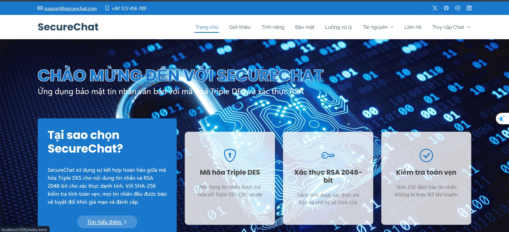
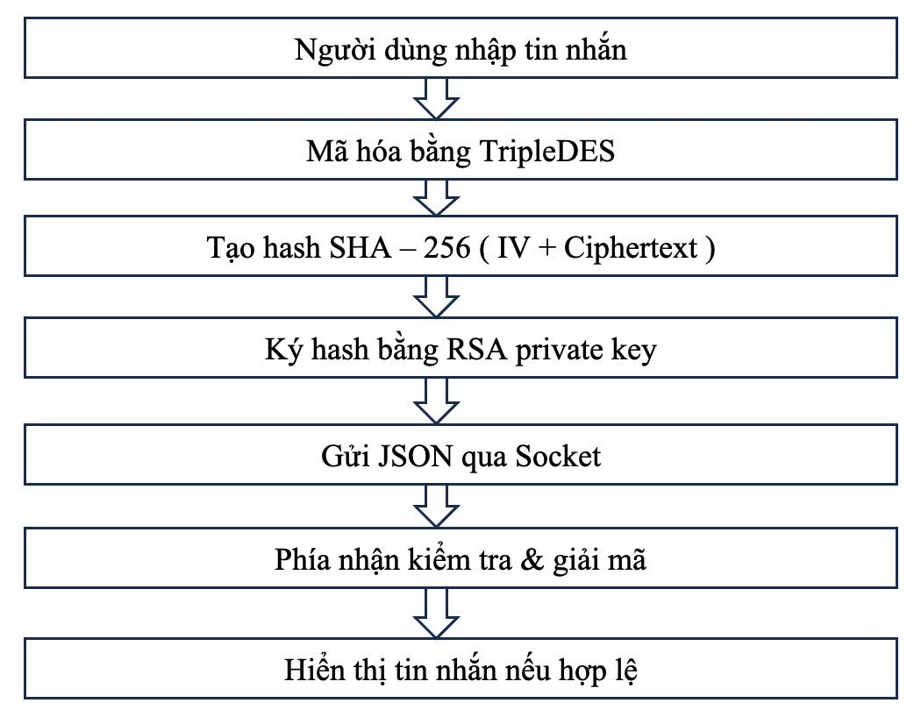
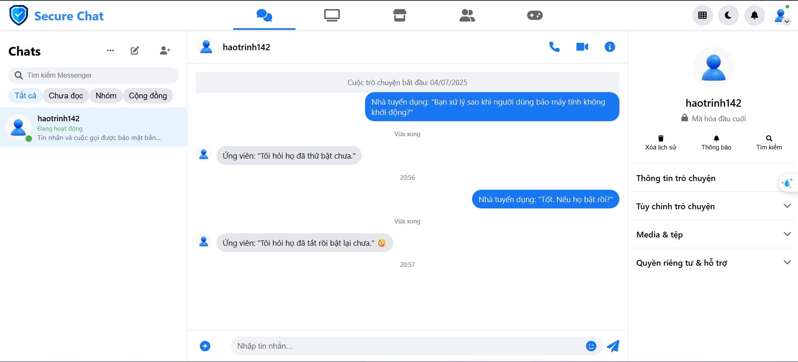
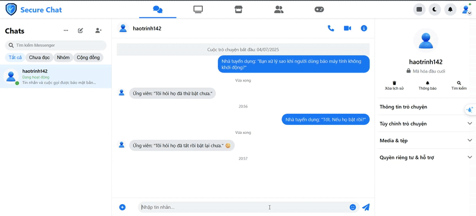

<div align="center">
  <h1>🔒 Ứng Dụng Bảo Mật Tin Nhắn Văn Bản Với TripleDES và RSA</h1>
</div>

<div align="center">
  
  
</div>

<div align="center">
  
</div>

<div align="center">

[](https://www.python.org)
[](LICENSE)
[](https://fit.dainam.edu.vn)
[](https://dainam.edu.vn)
[](https://github.com/Trinhvhao/SecureChat)

</div>


<h3 align="center">🔐 Bảo Mật Liên Lạc Với Công Nghệ Mã Hóa Tiên Tiến</h3>

<p align="center">
  <strong>Hệ thống nhắn tin an toàn sử dụng TripleDES và RSA cho học phần Nhập môn An toàn, Bảo mật Thông tin</strong>
</p>

---

## 📋 Mục Lục

- [🏗️ Kiến Trúc Hệ Thống](#️-kiến-trúc-hệ-thống)
- [✨ Tính Năng Chính](#-tính-năng-chính)
- [🔧 Công Nghệ Sử Dụng](#-công-nghệ-sử-dụng)
- [📂 Cấu Trúc Thư Mục](#-cấu-trúc-thư-mục)
- [📥 Cài Đặt](#-cài-đặt)
- [▶️ Chạy Ứng Dụng](#️-chạy-ứng-dụng)
- [📈 Hiệu Suất và Bảo Mật](#-hiệu-suất-và-bảo-mật)
- [🤝 Đóng Góp](#-đóng-góp)
- [📜 Giấy Phép](#-giấy-phép)
- [📬 Liên Hệ](#-liên-hệ)

---
## 🏗️ Kiến Trúc Hệ Thống

<div align="center">
  
</div>

Hệ thống hoạt động theo mô hình **P2P với mã hóa đầu cuối (End-to-End Encryption)**, đảm bảo **bí mật**, **toàn vẹn**, và **xác thực** của tin nhắn người dùng.
### 🔐 Quy trình gửi và nhận tin nhắn:

1. **Người dùng nhập tin nhắn**
2. **Mã hóa bằng thuật toán TripleDES**  
   - Sử dụng khóa đối xứng (đã trao đổi từ trước)  
   - Chế độ CBC với IV ngẫu nhiên
3. **Tạo chuỗi hash SHA-256**  
   - Dựa trên `IV || Ciphertext`  
   - Đảm bảo kiểm tra toàn vẹn nội dung
4. **Ký số chuỗi hash bằng RSA Private Key**  
   - Tạo chữ ký số xác thực người gửi
5. **Gói toàn bộ dữ liệu thành JSON và gửi qua Socket**
6. **Phía nhận kiểm tra chữ ký & giải mã**
   - Kiểm tra tính hợp lệ của hash + xác minh chữ ký
   - Nếu hợp lệ → giải mã ciphertext bằng TripleDES
7. **Hiển thị tin nhắn ra giao diện người nhận**

---

### ⚙️ Các thành phần chính

#### 🔑 Xác thực & Mã hóa khóa
- **RSA-2048**: dùng cho ký số và trao đổi khóa
- **TripleDES**: mã hóa nội dung
- **SHA-256**: đảm bảo toàn vẹn

#### 🌐 Giao tiếp P2P qua socket
- **Giao diện Flask** cho người dùng
- **Socket** truyền trực tiếp giữa 2 máy
- **Xử lý lỗi** (ACK/NACK, mất kết nối)

---
## ✨ Tính Năng Chính

### 🔐 Bảo Mật Toàn Diện

| Tính Năng | Mô Tả | Công Nghệ |
|-----------|--------|-----------|
| **Mã Hóa Tin Nhắn** | Bảo vệ nội dung tin nhắn khỏi nghe lén | TripleDES (CBC mode) |
| **Xác Thực Danh Tính** | Xác minh người gửi và người nhận | RSA 2048-bit |
| **Kiểm Tra Toàn Vẹn** | Phát hiện tin nhắn bị giả mạo | SHA-256 |

### ⚡ Hiệu Suất Cao

- **🖥️ Giao Diện Web**: Flask framework với UI trực quan
- **🔄 P2P Communication**: Giao tiếp trực tiếp, giảm độ trễ
- **⚠️ Error Management**: Xử lý lỗi thông minh với ACK/NACK
- **📊 Real-time Updates**: Cập nhật tin nhắn theo thời gian thực

### 📱 Giao Diện Thân Thiện

<div align="center">
  
</div>

- **💬 Chat Interface**: Khung chat hiện đại, dễ sử dụng
- **📝 Message History**: Lưu trữ lịch sử tin nhắn
- **🔔 Notifications**: Thông báo trạng thái tin nhắn, tin nhắn mới
- **📱 Xoá tin nhắn an toàn**: Có sự chấp thuận của đối phương

---

## 🔧 Công Nghệ Sử Dụng

<div align="center">

### Backend Technologies
[](https://www.python.org/)
[](https://flask.palletsprojects.com/)
[](https://www.sqlite.org/)

### Security & Cryptography
[](https://cryptography.io)
[](https://en.wikipedia.org/wiki/RSA_(cryptosystem))
[](https://en.wikipedia.org/wiki/Triple_DES)
[](https://en.wikipedia.org/wiki/SHA-2)

### Frontend
[](https://developer.mozilla.org/en-US/docs/Web/HTML)
[](https://developer.mozilla.org/en-US/docs/Web/CSS)
[](https://developer.mozilla.org/en-US/docs/Web/JavaScript)

</div>

---

## 📂 Cấu Trúc Thư Mục

```plaintext
secure_chat_p2pp/
├── 📁 .venv/                      # Môi trường ảo (Virtual Environment)
├── 📁 instance/
│   └── 📄 chat.db                # Cơ sở dữ liệu SQLite
├── 📁 static/
│   ├── 📁 img/                   # Thư mục hình ảnh
│   │   ├── 🖼️ banner.png         # Banner ứng dụng
│   │   ├── 🖼️ logo-dainam.png    # Logo Đại học Đại Nam
│   │   ├── 🖼️ logo-khoa-cntt.png # Logo Khoa CNTT
│   │   ├── 🖼️ architecture-diagram.png # Sơ đồ kiến trúc
│   │   ├── 🖼️ chat-interface.png  # Giao diện chat
│   │   └── 🎬 demo.gif           # Demo ứng dụng
│   └── 📁 vendor/                # Thư viện frontend
│       ├── 📄 index.css
│       ├── 📄 index.js
│       ├── 📄 script.js
│       └── 📄 style.css
├── 📁 templates/                 # Templates HTML
│   ├── 📄 auth.html
│   ├── 📄 chat.html
│   └── 📄 index.html
├── 📄 app.py                     # Tệp khởi chạy Flask
├── 📄 config.py                  # Cấu hình ứng dụng
├── 📄 logging_config.py          # Cấu hình logging
├── 📄 models.py                  # Mô hình dữ liệu (ORM)
├── 📄 routes.py                  # Định tuyến Flask
├── 📄 test.py                    # Tệp kiểm thử
├── 📄 utils.py                   # Hàm tiện ích
├── 📄 requirements.txt           # Danh sách thư viện
└── 📄 README.md                  # Tài liệu hướng dẫn
```

---

## 📥 Cài Đặt

### 🛠️ Yêu Cầu Hệ Thống

- **Python**: 3.10 trở lên
- **RAM**: Tối thiểu 4GB
- **Dung lượng**: 500MB trống
- **Mạng**: Kết nối Internet cho P2P

### ⚙️ Thiết Lập Dự Án

1. **Sao chép repository**:
   ```bash
   git clone https://github.com/Trinhvhao/SecureChat.git
   cd SecureChat
   ```

2. **Tạo môi trường ảo**:
   ```bash
   # Linux/Mac
   python -m venv .venv
   source .venv/bin/activate
   
   # Windows
   python -m venv .venv
   .venv\Scripts\activate
   ```

3. **Cài đặt dependencies**:
   ```bash
   pip install -r requirements.txt
   ```

4. **Cấu hình ứng dụng**:
   ```bash
   # Tạo cặp khóa RSA
   python -c "from utils import generate_keypair; generate_keypair()"
   
   # Cập nhật cấu hình trong config.py
   ```

---

## ▶️ Chạy Ứng Dụng

### 🚀 Khởi Động

```bash
# Khởi động server
python app.py

# Output mong đợi:
# * Running on http://localhost:5000
# * Debug mode: on
```

### 🌐 Truy Cập

1. **Mở trình duyệt**: `http://localhost:5000`
2. **Đăng nhập**: Sử dụng tài khoản demo hoặc tạo mới
3. **Sử dụng**: Gửi tin nhắn an toàn qua giao diện chat

### 📺 Demo

<div align="center">
  
</div>

*Nhấp vào hình ảnh để xem video demo đầy đủ*

---

## 📈 Hiệu Suất và Bảo Mật

### 🔒 Đánh Giá Bảo Mật

| Thành Phần | Mức Độ Bảo Mật | Ghi Chú |
|------------|-----------------|---------|
| **TripleDES** | ⭐⭐⭐⭐ | Bảo mật cao, nhưng chậm hơn AES |
| **RSA 2048-bit** | ⭐⭐⭐⭐⭐ | Độ bảo mật cao cho xác thực |
| **SHA-256** | ⭐⭐⭐⭐⭐ | Nguy cơ collision gần như 0 |
| **P2P Protocol** | ⭐⭐⭐⭐ | An toàn nhưng cần xử lý network errors |

### ⚡ Hiệu Suất

- **Encryption Speed**: ~1MB/s với TripleDES
- **Key Exchange**: <100ms cho RSA handshake
- **Message Latency**: <50ms trong LAN
- **Memory Usage**: ~50MB RAM

### 🔧 Khuyến Nghị Cải Thiện

- **Production**: Cân nhắc sử dụng AES thay cho TripleDES
- **Scalability**: Implement connection pooling cho nhiều users
- **Security**: Thêm rate limiting và brute force protection
- **Performance**: Sử dụng async/await cho I/O operations

---

## 🤝 Đóng Góp

Chúng tôi hoan nghênh mọi đóng góp! Vui lòng làm theo quy trình sau:

### 📝 Quy Trình Đóng Góp

1. **Fork repository**
2. **Tạo nhánh feature**:
   ```bash
   git checkout -b feature/tính-năng-mới
   ```
3. **Commit thay đổi**:
   ```bash
   git commit -m "feat: thêm tính năng XYZ"
   ```
4. **Push lên GitHub**:
   ```bash
   git push origin feature/tính-năng-mới
   ```
5. **Tạo Pull Request**

### 🎯 Hướng Dẫn Đóng Góp

- **Code Style**: Tuân thủ PEP 8 cho Python
- **Documentation**: Cập nhật README khi thêm tính năng
- **Testing**: Viết unit tests cho code mới
- **Security**: Báo cáo lỗi bảo mật qua email riêng

---

## 📜 Giấy Phép

```
MIT License

Copyright (c) 2025 Khoa Công Nghệ Thông Tin, Đại Học Đại Nam

Permission is hereby granted, free of charge, to any person obtaining a copy
of this software and associated documentation files (the "Software"), to deal
in the Software without restriction, including without limitation the rights
to use, copy, modify, merge, publish, distribute, sublicense, and/or sell
copies of the Software, and to permit persons to whom the Software is
furnished to do so, subject to the following conditions:

The above copyright notice and this permission notice shall be included in all
copies or substantial portions of the Software.

THE SOFTWARE IS PROVIDED "AS IS", WITHOUT WARRANTY OF ANY KIND, EXPRESS OR
IMPLIED, INCLUDING BUT NOT LIMITED TO THE WARRANTIES OF MERCHANTABILITY,
FITNESS FOR A PARTICULAR PURPOSE AND NONINFRINGEMENT. IN NO EVENT SHALL THE
AUTHORS OR COPYRIGHT HOLDERS BE LIABLE FOR ANY CLAIM, DAMAGES OR OTHER
LIABILITY, WHETHER IN AN ACTION OF CONTRACT, TORT OR OTHERWISE, ARISING FROM,
OUT OF OR IN CONNECTION WITH THE SOFTWARE OR THE USE OR OTHER DEALINGS IN THE
SOFTWARE.
```

---

## 📬 Liên Hệ

<div align="center">

### 👥 Nhóm Phát Triển

| Vai Trò            | Họ và Tên              | Email                 | GitHub                                     |
|--------------------|------------------------|-----------------------|---------------------------------------------|
| **Project Lead**   | Trịnh Văn Hào          | haotrinh142@gmail.com | [@Trinhvhao](https://github.com/Trinhvhao) |
| **Frontend Dev**   | Chu Văn Huy            | huycv@gmail.com       | [@chuvanhuy](https://github.com/chuvanhuy) |
| **Report**         | Nguyễn Thị Mai Hương   | huongnt@gmail.com   | [@huongmai](https://github.com/huongmai)   |
| **Report**         | Nguyễn Giáp            | giapng@gmail.com    | [@nguyengiap](https://github.com/nguyengiap) |

### 🏫 Liên Hệ Khoa

[](mailto:contact@fit.dainam.edu.vn)
[](https://fit.dainam.edu.vn)
[](https://github.com/khoa-cntt-dainam)

**Khoa Công Nghệ Thông Tin**  
Đại Học Đại Nam  
📍 Hà Nội, Việt Nam

</div>

---

<div align="center">
  
**⭐ Nếu project này hữu ích, hãy star để ủng hộ nhóm phát triển!**

[](https://github.com/Trinhvhao/SecureChat)
[](https://github.com/Trinhvhao/SecureChat)

</div>
